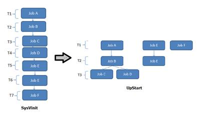

# systemd特点

与System V风格init相比，systemd采用了以下新技术：

1. 将service（服务）、target（运行模式，类似于运行等级）、mount、timer、snapshot、path、socket、swap等称为Unit。比如，一个auditd服务（就是auditd.service）就是一个Unit，一个multi-user.target运行模式也是一个Unit。
2. 采用Socket激活式与D-Bus激活式服务，以提高相互依赖的各服务的并行运行性能；
3. 用cgroups代替进程ID来追踪进程，以此即使是两次fork之后生成的守护进程也不会脱离systemd的控制。
4. 用target代替System V的运行级别（Runlevel），比如，SystemD的graphical.target相当于System V的init 5，multi-user.target相当于System V的init 3。
5. 内置新的journald 日志管理系统。
6. 引入localectl、timedatectl等新命令，系统配置更方便。

从设计构思上说，由于systemd使用了cgroup与fanotify等组件以实现其特性，所以只适用于Linux。有鉴于此，考虑到kFreeBSD分支的软件源无法纳入systemd，为与其他分支保持一致，Debian开发者尽力避免纳入systemd。但**Lennart Poettering本人对此并不在意，并称“Debian GNU/kFreeBSD不过是玩具系统”**。但Debain 8.0 Jessie开始以systemd取代sysvinit。

Systemd 是 Linux 系统中最新的初始化系统（init），它主要的设计目标是克服 sysvinit 固有的缺点，提高系统的启动速度。

**演变趋势： sysvinit -> upstart -> systemd**

systemd 和 ubuntu 的 upstart 是竞争对手，预计会取代 UpStart，实际上 Ubuntu 已经采用 systemd 作为其标准的系统初始化系统。

Systemd 的很多概念来源于苹果 Mac OS 操作系统上的 *launchd*，不过 launchd 专用于苹果系统，因此长期未能获得应有的广泛关注。Systemd 借鉴了很多 launchd 的思想，它的重要特性如下：

## 同 SysVinit 和 LSB init scripts 兼容

Systemd 是一个"新来的"，Linux 上的很多应用程序并没有来得及为它做相应的改变。和 UpStart 一样，systemd 引入了新的配置方式，对应用程序的开发也有一些新的要求。

如果 systemd 想替代目前正在运行的初始化系统，就必须和现有程序兼容。

任何一个 Linux 发行版都很难为了采用 systemd 而在短时间内将所有的服务代码都修改一遍。

Systemd 提供了和 Sysvinit 以及 LSB initscripts 兼容的特性。系统中已经存在的服务和进程无需修改。这降低了系统向 systemd 迁移的成本，使得 systemd 替换现有初始化系统成为可能。

## 更快的启动速度

Systemd 提供了比 UpStart 更激进的并行启动能力，采用了 **socket / D-Bus activation** 等技术启动服务。一个显而易见的结果就是：更快的启动速度。

为了减少系统启动时间，systemd 的目标是：

* 尽可能启动更少的进程
* 尽可能将更多进程并行启动

同样地，UpStart 也试图实现这两个目标。UpStart 采用事件驱动机制，服务可以暂不启动，当需要的时候才通过事件触发其启动，这符合第一个设计目标；此外，不相干的服务可以并行启动，这也实现了第二个目标。

下面的图形演示了 UpStart 相对于 SysVInit 在并发启动这个方面的改进：

假设有 7 个不同的启动项目， 比如 JobA、Job B 等等。在 SysVInit 中，每一个启动项目都由一个独立的脚本负责，它们**由 sysVinit 顺序地，串行地调用**。因此总的启动时间为 **T1+T2+T3+T4+T5+T6+T7**。

相比而言，UpsStart能考虑到其中一些任务有依赖关系，比如 A,B,C,D。而 Job E 和 F 却和 A,B,C,D 无关。这种情况下，UpStart 能够并发地运行任务{E，F，(A,B,C,D)}，使得总的启动时间减少为 **T1+T2+T3**。

这无疑增加了系统启动的并行性，从而提高了系统启动速度。但是**在 UpStart 中，有依赖关系的服务还是必须先后启动。比如任务 A,B,(C,D)因为存在依赖关系，所以在这个局部，还是串行执行。**

让我们例举一些例子， Avahi 服务需要 D-Bus 提供的功能，因此 Avahi 的启动依赖于 D-Bus，UpStart 中，Avahi 必须等到 D-Bus 启动就绪之后才开始启动。类似的，livirtd 和 X11 都需要 HAL 服务先启动，而所有这些服务都需要 syslog 服务记录日志，因此它们都必须等待 syslog 服务先启动起来。然而 httpd 和他们都没有关系，因此 httpd 可以和 Avahi 等服务并发启动。

Systemd 能够更进一步提高并发性，即便对于那些 UpStart 认为存在相互依赖而必须串行的服务，比如 Avahi 和 D-Bus 也可以并发启动。从而实现如下图所示的并发启动过程：

所有的任务都同时并发执行，总的启动时间被进一步降低为 T1。

可见 systemd 比 UpStart 更进一步提高了并行启动能力，极大地加速了系统启动时间。

## systemd 提供按需启动能力

当 sysvinit 系统初始化的时候，它会将所有可能用到的后台服务进程全部启动运行。并且系统必须等待所有的服务都启动就绪之后，才允许用户登录。这种做法有两个缺点：首先是启动时间过长；其次是系统资源浪费。

某些服务很可能在很长一段时间内，甚至整个服务器运行期间都没有被使用过。比如 CUPS，打印服务在多数服务器上很少被真正使用到。您可能没有想到，在很多服务器上 SSHD 也是很少被真正访问到的。花费在启动这些服务上的时间是不必要的；同样，花费在这些服务上的系统资源也是一种浪费。

Systemd 可以提供按需启动的能力，只有在某个服务被真正请求的时候才启动它。当该服务结束，systemd 可以关闭它，等待下次需要时再次启动它。

## Systemd 采用 Linux 的 Cgroup 特性跟踪和管理进程的生命周期

init 系统的一个重要职责就是负责跟踪和管理服务进程的生命周期。它不仅可以启动一个服务，也必须也能够停止服务。这看上去没有什么特别的，然而在真正用代码实现的时候，您或许会发现停止服务比一开始想的要困难。

服务进程一般都会作为精灵进程（daemon）在后台运行，为此服务程序有时候会派生(fork)两次。在 UpStart 中，需要在配置文件中正确地配置 expect 小节。这样 UpStart 通过对 fork 系统调用进行计数，从而获知真正的精灵进程的 PID 号。比如图 3 所示的例子：

图 3. 找到正确 pid
找到正确 pid
如果 UpStart 找错了，将 p1`作为服务进程的 Pid，那么停止服务的时候，UpStart 会试图杀死 p1`进程，而真正的 p1``进程则继续执行。换句话说该服务就失去控制了。

还有更加特殊的情况。比如，一个 CGI 程序会派生两次，从而脱离了和 Apache 的父子关系。当 Apache 进程被停止后，该 CGI 程序还在继续运行。而我们希望服务停止后，所有由它所启动的相关进程也被停止。

为了处理这类问题，UpStart 通过 strace 来跟踪 fork、exit 等系统调用，但是这种方法很笨拙，且缺乏可扩展性。systemd 则利用了 Linux 内核的特性即 CGroup 来完成跟踪的任务。当停止服务时，通过查询 CGroup，systemd 可以确保找到所有的相关进程，从而干净地停止服务。

CGroup 已经出现了很久，它主要用来实现系统资源配额管理。CGroup 提供了类似文件系统的接口，使用方便。当进程创建子进程时，子进程会继承父进程的 CGroup。因此无论服务如何启动新的子进程，所有的这些相关进程都会属于同一个 CGroup，systemd 只需要简单地遍历指定的 CGroup 即可正确地找到所有的相关进程，将它们一一停止即可。

## 启动挂载点和自动挂载的管理

传统的 Linux 系统中，用户可以用/etc/fstab 文件来维护固定的文件系统挂载点。这些挂载点在系统启动过程中被自动挂载，一旦启动过程结束，这些挂载点就会确保存在。这些挂载点都是对系统运行至关重要的文件系统，比如 HOME 目录。和 sysvinit 一样，Systemd 管理这些挂载点，以便能够在系统启动时自动挂载它们。Systemd 还兼容/etc/fstab 文件，您可以继续使用该文件管理挂载点。

有时候用户还需要动态挂载点，比如打算访问 DVD 内容时，才临时执行挂载以便访问其中的内容，而不访问光盘时该挂载点被取消(umount)，以便节约资源。传统地，人们依赖 autofs 服务来实现这种功能。

Systemd 内建了自动挂载服务，无需另外安装 autofs 服务，可以直接使用 systemd 提供的自动挂载管理能力来实现 autofs 的功能。

## 实现事务性依赖关系管理

系统启动过程是由很多的独立工作共同组成的，这些工作之间可能存在依赖关系，比如挂载一个 NFS 文件系统必须依赖网络能够正常工作。Systemd 虽然能够最大限度地并发执行很多有依赖关系的工作，但是类似"挂载 NFS"和"启动网络"这样的工作还是存在天生的先后依赖关系，无法并发执行。对于这些任务，systemd 维护一个"事务一致性"的概念，保证所有相关的服务都可以正常启动而不会出现互相依赖，以至于死锁的情况。

## 能够对系统进行快照和恢复

systemd 支持按需启动，因此系统的运行状态是动态变化的，人们无法准确地知道系统当前运行了哪些服务。Systemd 快照提供了一种将当前系统运行状态保存并恢复的能力。

比如系统当前正运行服务 A 和 B，可以用 systemd 命令行对当前系统运行状况创建快照。然后将进程 A 停止，或者做其他的任意的对系统的改变，比如启动新的进程 C。在这些改变之后，运行 systemd 的快照恢复命令，就可立即将系统恢复到快照时刻的状态，即只有服务 A，B 在运行。一个可能的应用场景是调试：比如服务器出现一些异常，为了调试用户将当前状态保存为快照，然后可以进行任意的操作，比如停止服务等等。等调试结束，恢复快照即可。

这个快照功能目前在 systemd 中并不完善，似乎开发人员也没有特别关注它，因此有报告指出它还存在一些使用上的问题，使用时尚需慎重。

## 日志服务

systemd 自带日志服务 journald，该日志服务的设计初衷是克服现有的 syslog 服务的缺点。比如：

syslog 不安全，消息的内容无法验证。每一个本地进程都可以声称自己是 Apache PID 4711，而 syslog 也就相信并保存到磁盘上。
数据没有严格的格式，非常随意。自动化的日志分析器需要分析人类语言字符串来识别消息。一方面此类分析困难低效；此外日志格式的变化会导致分析代码需要更新甚至重写。
Systemd Journal 用二进制格式保存所有日志信息，用户使用 journalctl 命令来查看日志信息。无需自己编写复杂脆弱的字符串分析处理程序。

Systemd Journal 的优点如下：

* 简单性：代码少，依赖少，抽象开销最小。
* 零维护：日志是除错和监控系统的核心功能，因此它自己不能再产生问题。举例说，自动管理磁盘空间，避免由于日志的不断产生而将磁盘空间耗尽。
* 移植性：日志 文件应该在所有类型的 Linux 系统上可用，无论它使用的何种 CPU 或者字节序。
* 性能：添加和浏览日志非常快。
* 最小资源占用：日志数据文件需要较小。
* 统一化：各种不同的日志存储技术应该统一起来，将所有的可记录事件保存在同一个数据存储中。所以日志内容的全局上下文都会被保存并且可供日后查询。例如一条固件记录后通常会跟随一条内核记录，最终还会有一条用户态记录。重要的是当保存到硬盘上时这三者之间的关系不会丢失。Syslog 将不同的信息保存到不同的文件中，分析的时候很难确定哪些条目是相关的。
* 扩展性：日志的适用范围很广，从嵌入式设备到超级计算机集群都可以满足需求。
* 安全性：日志 文件是可以验证的，让无法检测的修改不再可能。
